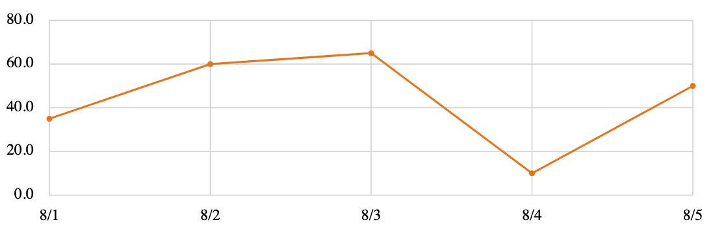

---

[](https://github.com/gridpoint-com/plox/actions) [](https://hex.pm/packages/plox) [](https://hexdocs.pm/plox/)

Server-side rendered SVG graphing components for Phoenix and LiveView.

## Installation

Plox is [available in Hex](https://hex.pm/packages/plox), the package can be
installed by adding `plox` to your list of dependencies in `mix.exs`:

```elixir
def deps do
  [
    {:plox, "~> 0.2.0"}
  ]
end
```

Documentation is published on [HexDocs](https://hexdocs.pm) and can be found at
<https://hexdocs.pm/plox>.

## Example



Start by setting up your data, dimensions, axes, and dataset:

```elixir
data = [
  %{date: ~D[2023-08-01], value: 35.0},
  %{date: ~D[2023-08-02], value: 60.0},
  %{date: ~D[2023-08-03], value: 65.0},
  %{date: ~D[2023-08-04], value: 10.0},
  %{date: ~D[2023-08-05], value: 50.0}
]

dimensions = Plox.Dimensions.new(800, 250)

x_axis = Plox.XAxis.new(
  Plox.DateScale.new(Date.range(~D[2023-08-01], ~D[2023-08-05])),
  dimensions
)

y_axis = Plox.YAxis.new(Plox.NumberScale.new(0.0, 80.0), dimensions)

dataset =
  Plox.Dataset.new(data,
    x: {x_axis, & &1.date},
    y: {y_axis, & &1.value}
  )
```

Once you have those, you can render a `graph` component within your HEEx template:

```html
<.graph id="example_graph" dimensions={@dimensions}>
  <.x_axis_labels :let={date} axis={@x_axis}>
    {Calendar.strftime(date, "%-m/%-d")}
  </.x_axis_labels>

  <.y_axis_labels :let={value} axis={@y_axis} ticks={5}>
    {value}
  </.y_axis_labels>

  <.x_axis_grid_lines axis={@x_axis} stroke="#D3D3D3" />
  <.y_axis_grid_lines axis={@y_axis} ticks={5} stroke="#D3D3D3" />

  <.polyline dataset={@dataset} stroke="#EC7E16" stroke-width={2} />

  <.circle cx={@dataset[:x]} cy={@dataset[:y]} r={3} fill="#EC7E16" />
</.graph>
```
